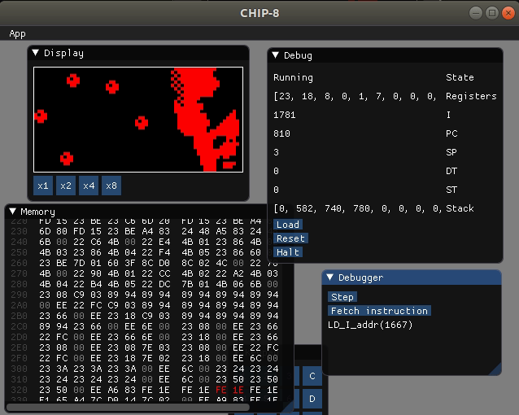

# chip8 interpreter

A [**chip8**](https://en.wikipedia.org/wiki/CHIP-8) interpreter in Rust.

```
chip8 0.1.0
Program arguments

USAGE:
    chip8 [FLAGS] [OPTIONS]

FLAGS:
    -h, --help       Prints help information
        --nosound    Disable sound
    -V, --version    Prints version information

OPTIONS:
    -f, --freq <beep-freq>    Sound frequency [default: 500]
    -c, --clock <clock>       Steps per clock cycle [default: 1]
    -r, --rom <rom>           Rom location
```

